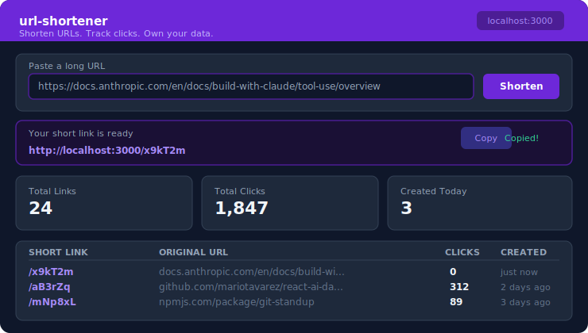

<div align="center">

<br/>

# url-shortener

**Shorten URLs. Track clicks. Own your data.**

No sign-up. No cloud. No external services. A fully self-hosted URL shortener with built-in analytics — deploy it anywhere in under 5 minutes.

<br/>

[](https://nextjs.org)
[](https://www.typescriptlang.org)
[](https://www.sqlite.org)
[](https://tailwindcss.com)
[](LICENSE)

<br/>



<br/>

```bash
git clone https://github.com/mariotavarez/url-shortener.git
cd url-shortener && npm install && npm run dev
```

Open [http://localhost:3000](http://localhost:3000) — ready instantly. No database setup. No env vars.

<br/>

</div>

---

## Why this exists

Every URL shortener I tried required an account, an API key, or a database server. This one needs none of that.

Clone it, run `npm run dev`, and you have a working short-link service with analytics in your browser — all backed by a single SQLite file that lives next to the code.

---

## What it does

| Feature | Detail |
|---|---|
| **Shorten any URL** | 6-character nanoid codes — collision-safe, URL-safe |
| **Redirect tracking** | Every click increments a counter — zero overhead via embedded SQLite |
| **Analytics dashboard** | KPI cards: total links, total clicks, links created today |
| **Sortable link table** | Sort by date, clicks, or short code — server-rendered, no client state |
| **Copy to clipboard** | One click to copy — "Copied!" feedback with automatic reset |
| **Delete links** | Remove any short link from the dashboard instantly |
| **Auto-prepend https://** | Paste a bare domain and it just works |

---

## How it works

```
User pastes URL → Server Action validates + generates code via nanoid
                → better-sqlite3 stores mapping in data/data.db

User visits /x9kT2m → Route Handler looks up code
                     → Increments click counter (synchronous, fast)
                     → 302 redirect to original URL

Dashboard        → Server Component reads live SQLite data
                 → Renders stats + sortable table (no API calls)
```

---

## Quick Start

```bash
git clone https://github.com/mariotavarez/url-shortener.git
cd url-shortener
npm install
npm run dev
```

Visit `http://localhost:3000`. The SQLite database is created automatically on first run at `data/data.db`.

**Type-check:**
```bash
npx tsc --noEmit
```

**Production build:**
```bash
npm run build && npm start
```

---

## Project Structure

```
src/
├── app/
│   ├── layout.tsx              # Root layout — dark theme, sticky nav
│   ├── page.tsx                # Home — shorten form + recent links
│   ├── [code]/route.ts         # Redirect handler + click tracking
│   └── dashboard/page.tsx      # Analytics dashboard
├── components/
│   ├── ShortenForm.tsx         # Client form with useTransition
│   ├── CopyButton.tsx          # Clipboard copy with "Copied!" feedback
│   ├── LinkCard.tsx            # Compact link row
│   ├── StatsCard.tsx           # KPI card (violet / purple / fuchsia variants)
│   └── LinksTable.tsx          # Sortable table with delete
└── lib/
    ├── db.ts                   # SQLite singleton — WAL mode, typed queries
    ├── actions.ts              # Server Actions: shorten, delete, stats, track
    └── utils.ts                # generateCode, formatDate, isValidUrl, truncate
```

---

## Tech Stack

| Layer | Technology | Version |
|---|---|---|
| Framework | Next.js App Router + Server Actions | 15 |
| Language | TypeScript strict mode | 5.7 |
| Styling | Tailwind CSS via `@tailwindcss/postcss` | v4 |
| Database | SQLite via `better-sqlite3` (embedded) | 9 |
| ID generation | `nanoid` (6-char URL-safe codes) | 5 |
| Icons | `lucide-react` | 0.344 |

---

## License

MIT © [Mario Tavarez](https://github.com/mariotavarez)
